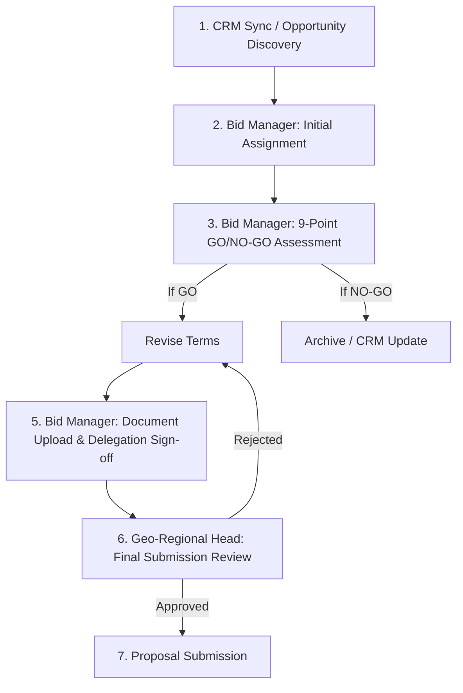

# 🏗️ System Design: Opportunity Management System (BQS)

## 1. Overview
This document outlines the architecture and workflow for the **BQS Opportunity Management System**, a multi-role platform designed to streamline the assessment, approval, and management of sales opportunities synchronized from Oracle CRM.

---

## 2. Business Objective Layer

The BQS platform is designed to transform "Gut-feeling" sales into "Data-driven" strategic decisions.

*   **Strategic Alignment**: Ensure 100% of pursued deals match organizational goals.
*   **Operational Excellence**: Reduce bid turnaround time by 30% through automated assignments and real-time tracking.
*   **Financial Integrity**: Mandate strict margin thresholds (PAT Margin) before final executive sign-off.
*   **Risk Mitigation**: Early detection of "Red Flag" opportunities via standardized multidimensional scoring.

---

## 3. Role Mapping to Actual Org

| System Role | Actual Organizational Title | Primary Responsibility |
| :--- | :--- | :--- |
| **Geo Head (GH)** | Executive Leadership / BU Head | Strategic P&L Oversight |
| **Regional Head** | Territory Lead / Ops Manager | Regional Pipeline Velocity |
| **Sales Head (SH)** | Vertical Sales Director | Sales Strategy & Team Direction |
| **Sales Manager** | Opportunity Owner | Deal Lifecycle Management |
| **Salesperson (SP)** | Account Executive | Customer Relationship & Data Accuracy |
| **Practice Head (PH)** | Solutions Delivery Director | Technical Capability & Resource Alignment |
| **Solution Architect (SA)**| Technical Pre-sales | Technical Solution Design & Scoring |
| **Legal/Finance** | Central Compliance Team | Risk Indemnity & Margin Approval |
| **Bid Manager** | Bid Excellence Team | Documentation & Process Governance |

---

## 2. PostgreSQL Schema Design (Normalized & Scalable)

The database is designed to handle complex reporting hierarchies and multi-stakeholder workflows.

### 2.1 Identity & Access Management
| Table | Description | Key Columns |
| :--- | :--- | :--- |
| `app_user` | User registry | `user_id`, `email`, `display_name`, `is_active` |
| `role` | Role definitions | `role_id`, `role_code` (GH, SH, PH, SA, SP, LEGAL, FINANCE), `role_name` |
| `user_role` | User-role mapping | `user_id`, `role_id` |

### 2.2 Core Opportunity Workflow State
The `opportunity` table serves as the primary state machine for the workflow.

| Column | Type | Description |
| :--- | :--- | :--- |
| `opp_id` | `String (PK)` | Oracle CRM Opportunity ID |
| `workflow_status` | `String` | Current state: `BM_INITIAL`, `BM_GATING`, `DEPT_REVIEW`, `FINAL_SUBMISSION` |
| `bid_manager_user_id` | `String (FK)` | **Primary Owner**: Orchestrates entire lifecycle |
| `bm_go_nogo_status` | `String` | `GO`, `NO-GO`, `PENDING` |
| `bm_scoring_data` | `JSONB` | Stores the 9-point assessment scores |
| `dept_docs_path` | `JSONB` | Links to uploaded documents from Legal/Finance/Practice |
| `practice_approval_signed_by_bm` | `Boolean` | Flag indicating BM signed on behalf of Practice (Email proof) |
| `legal_approval_signed_by_bm` | `Boolean` | Flag indicating BM signed on behalf of Legal |
| `finance_approval_signed_by_bm` | `Boolean` | Flag indicating BM signed on behalf of Finance |
| `geo_head_final_status` | `String` | Final sign-off: `APPROVED`, `REJECTED` |
| `pat_margin` | `Float` | Profit After Tax margin (Financial KPI) |

---

## 3. Workflow Diagram (Logic Sequence)

---

## 4. Role-Based Access & Visibility Logic

| Role | Dashboard Visibility | Key Actions |
| :--- | :--- | :--- |
| **Bid Manager (BM)** | **Global Pipeline Hub** | **Initial Filter**, 9-Point Scoring, Delegated Submissions |
| **Geo Head (GH)** | Final Approval Desk | Final Go/No-Go on Fully Scored Deals |
| **Practice Head (PH)**| Technical Feedback | Approve via Email/Portal for BM to submit |
| **Legal/Finance** | Compliance Review | Approve via Email/Portal for BM to submit |
| **Solution Architect**| Technical Inputs | Provide core data for 9-point criteria |
| **Salesperson (SP)** | Customer Context | Assist BM with "Customer Relationship" scoring |

---

## 5. Field Requirements per Workflow Stage

### Stage 1: Bid-Manager Gating (GO/NO-GO)
**9-Point Scoring Criteria:**
1. **Strategic Fit**: Alignment with Org BU roadmap.
2. **Win Probability**: Historical success with similar scope.
3. **Financial Value**: High-level deal value vs. margin potential.
4. **Competitive Position**: Knowledge of competition's pricing/tech.
5. **Delivery Feasibility**: Capacity of Practices to deliver.
6. **Customer Relationship**: Existing account history & level of engagement.
7. **Risk Exposure**: Delivery, legal, or regional risks.
8. **Product / Service Compliance**: Standard vs. Custom requirements.
9. **Legal & Commercial Readiness**: Complexity of contractual terms.

### Stage 2: Document & Collaboration
* **Documents**: Legal LoI, Finance Model, Practice BOM.
* **Delegation**: BM confirms "Approval received via Email" to unblock the workflow.

### Stage 3: Executive Review (Geo Head)
* **Fields**: Final 9-Point Summary, All Dept. Approvals, Combined Risk Profile.

---

## 6. Real-time Workflow Tracking (Implementation Notes)

1.  **Event-Driven Updates:** Use PostgreSQL Listen/Notify or FastAPI WebSockets to push status updates to the UI when a role completes their assignment.
2.  **Audit Trail:** Every status change inserts a record into `opportunity_assignment` capturing `timestamp`, `user_id`, and `action_type`.
3.  **Concurrency Control:** 
    *   **Field-level locking:** Only the assigned SA can edit the "Technical Scoring" section.
    *   **Timestamp verification:** Prevent overwriting if the CRM synced a newer value during an active edit session.

---

---

## 9. Frontend UX Layer (User Experience)

The UI is designed to minimize friction and maximize accountability through role-contextual interfaces.

*   **Adaptive Contextual Navigation**: Sidebar menus and dashboards dynamically reconfigure based on the user's active role.
*   **Visual Workflow Steppers**: Real-time progress bars showing exactly where a deal is in the pipeline (e.g., "Assigned to SA" -> "Pending Finance").
*   **Action-Oriented Inboxes**: "Requires Your Attention" section on every dashboard for immediate bottleneck resolution.
*   **Mobile-First Approvals**: Streamlined "Quick-Approve" interfaces for GH/SH leadership to sign off on deals remotely.

---

## 10. Decision Intelligence Layer

BQS goes beyond data collection to provide actionable intelligence for leadership.

*   **Win-Rate Correlation**: Visualizing the relationship between BQS scores and final deal outcomes (Win/Loss).
*   **Resource Utilization Heatmaps**: Identifying overloaded Practices or SAs to optimize resource allocation.
*   **Predictive Flagging**: Automated alerts for deals where the PAT margin falls below the 15% threshold or technical risk exceeds level 4.
*   **Global vs. Regional Benchmarking**: Comparing performance metrics across different Geographies to share best practices.

---

## 11. Best Practices & Scalability

1.  **Database Indexing:** Index `workflow_status` and `assigned_user_ids` (using GIN index for JSONB) to ensure rapid dashboard loading as datasets grow.
2.  **Stateless API:** Keep the backend stateless using JWT-based auth to allow horizontal scaling of the FastAPI services.
3.  **Soft Deletes:** Never delete opportunities. Use `is_active` or `is_archived` flags to preserve historical data for trend analytics.
4.  **Schema Evolution:** Utilize **Alembic** migrations to manage database changes across regional deployments.
